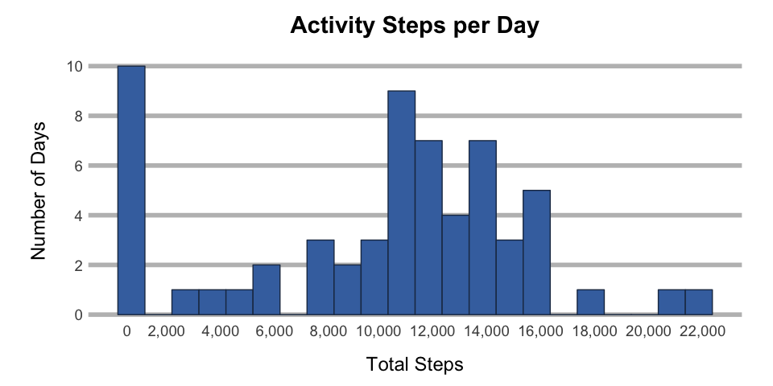
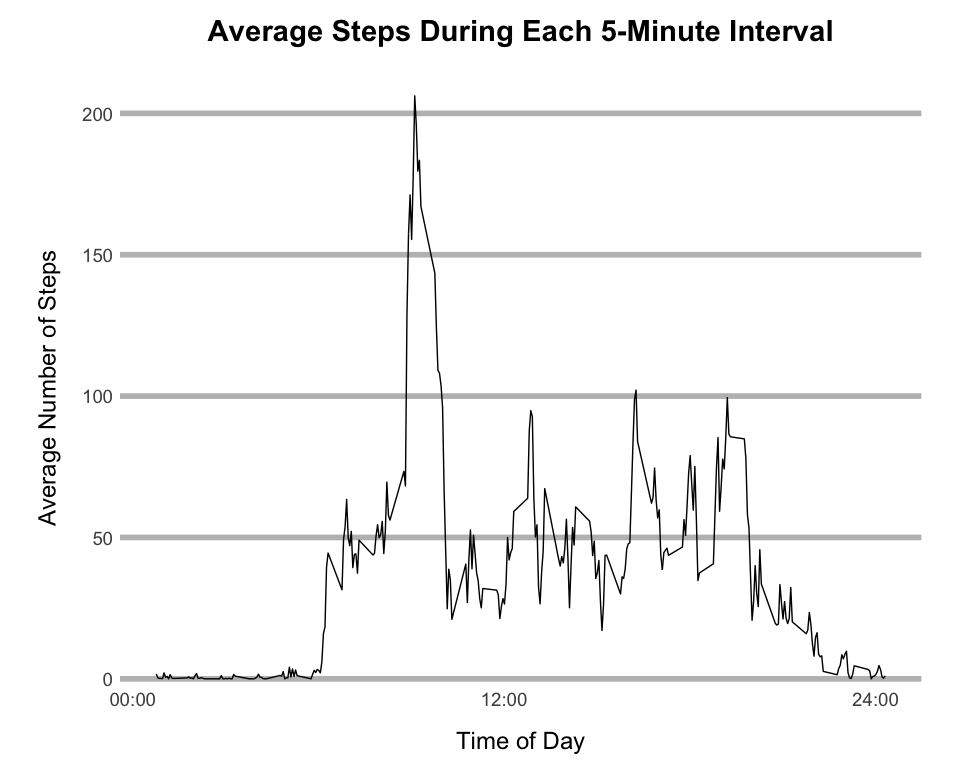
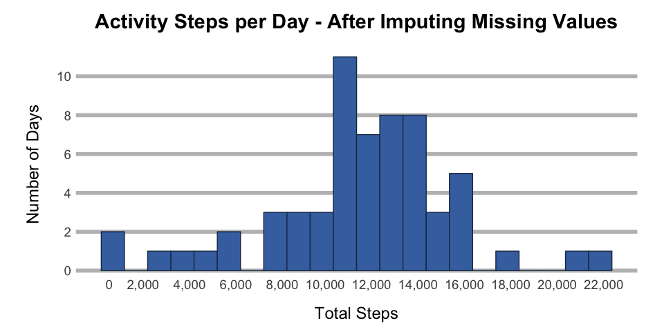
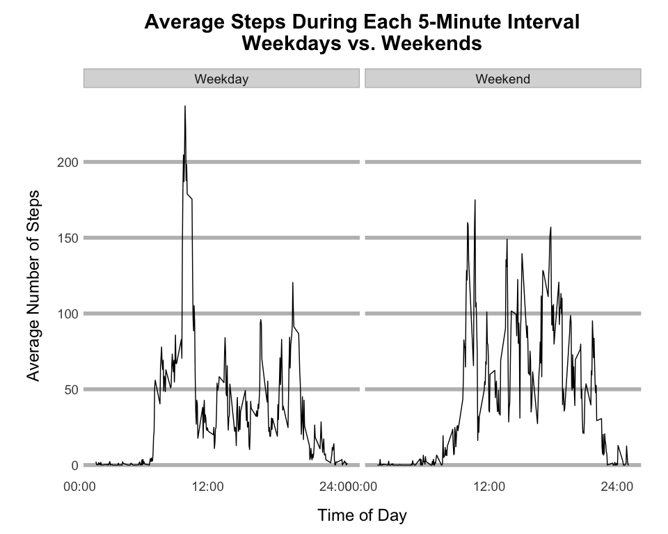

# Reproducible Research: Peer Assessment 1
Sarah Weadon  

### Introduction

This report looks at step activity collected from midnight October 1, 2012, through 11:59 p.m. November 30, 2012, by an anonomyous individual wearing a personal activity tracking device. Activity was recorded as a number of steps taken in 5-minute intervals. Averages of step counts throughout the report text have been rounded to the nearest whole number; however, all calculations were completed without rounding.

Five R packages are required for the code included throughout this report. Messages that may appear when loading these packages have been supressed here.


```r
library(readr)
library(dplyr)
library(ggplot2)
library(stringr)
library(lubridate)
```

### Data Loading and Preprocessing

No preprocessing of the data was required. However, an interval start time and end time in the format of hh:mm were created for graphing convenience. Intervals are 5-minutes each, starting as 0 (midnight), so start and end times follow the pattern illustrated in the table below.

interval | start.time | end.time
---|---|---
0  | 00:00 | 00:04
5  | 00:05 | 00:09
10 | 00:10 | 00:14
15 | 00:15 | 00:19


```r
activity.data <- read_csv(unz("activity.zip", "activity.csv")) %>%
  mutate(start.time = str_pad(interval, 4, "left", "0"),
         start.time = paste0(substr(start.time, 1, 2), ":", substr(start.time, 3, 4)),
         end.time = str_pad((interval + 4), 4, "left", "0"),
         end.time = paste0(substr(end.time, 1, 2), ":", substr(end.time, 3, 4)))
```

### Mean, Median, and Distribution


```r
daily.ttl <- activity.data %>% 
  group_by(date) %>% 
  summarize(steps = sum(steps, na.rm = T))

num.days <- n_distinct(daily.ttl$date)
daily.avg <- mean(daily.ttl$steps)
daily.med <- median(daily.ttl$steps)
under1000 <- sum(daily.ttl$steps < 1000)
percent.under <- under1000 / num.days * 100
```

The subject took 570,608 steps over the course of 61 days. This is an average of 9,354 steps per day. The median number of steps per day was 10,395. The difference between the average and median number of steps per day indicate the data is skewed.

Exploring the data further, the histogram below shows 10 days, or 16.4% percent of days, had 0 to 999 total steps recorded. This indicated a potential problem with the data which is explored and addressed in the "Imputing missing values" section below.


```r
ggplot(daily.ttl, aes(x = steps)) +
  geom_histogram(binwidth = 1000, fill = "#4271AE", color = "#1F3552") +
  scale_x_continuous(name = "Total Steps", 
                     breaks = seq(0, 22000, 2000),
                     label = function(x) {format(x, big.mark = ",")}) +
  scale_y_continuous(name = "Number of Days", 
                     breaks = seq(0, 20, 2)) +
  ggtitle("Activity Steps per Day") +
  theme(panel.grid.major.y = element_line(size = 2, color = "gray"),
        panel.grid.major.x = element_blank(),
        panel.grid.minor = element_blank(), 
        panel.background = element_blank(), 
        plot.margin = unit(c(1,2,1,2), "lines"),
        plot.title = element_text(size = 22, face = "bold", 
                                  margin = margin(0,0,20,0)),
        text = element_text(size = 18),
        axis.ticks = element_line(linetype = 0),
        axis.title.x = element_text(margin = margin(20,0,0,0)),
        axis.text.x = element_text(size = 14, margin = margin(-5,0,0,0),
                                   hjust = 1),
        axis.title.y = element_text(margin = margin(0,20,0,0)),
        axis.text.y = element_text(size = 14))
```

 

### Daily Pattern

After looking at the high-level summary of the data, here we start to get a more detailed understanding of the individual's activity patterns by looking at how their step activity is distributed through the day.


```r
interval.avg <- activity.data %>%
    group_by(interval) %>%
    summarize(avg.steps = mean(steps, na.rm = T))

max.interval <- interval.avg %>% left_join(activity.data, by = "interval") %>%
  select(interval, start.time, end.time, avg.steps) %>% arrange(desc(avg.steps)) %>% slice(1) 

ggplot(interval.avg, aes(interval)) +
  geom_line(aes(y = avg.steps)) +
  scale_x_continuous(name = "Time of Day",
                     breaks = seq(0, 2400, 1200),
                     limits = c(0, 2355),
                     label = function(x) { 
                       x <- str_pad(x, 4, "left", "0")
                       x <- paste0(substr(x, 1, 2), ":", substr(x, 3, 4))}) +
  scale_y_continuous(name = "Average Number of Steps", 
                     breaks = seq(0, 250, 50)) +
  ggtitle("Average Steps During Each 5-Minute Interval") +
  theme(panel.grid.major.y = element_line(size = 2, color = "gray"),
        panel.grid.major.x = element_blank(),
        panel.grid.minor = element_blank(), 
        panel.background = element_blank(), 
        plot.margin = unit(c(1,2,1,2), "lines"),
        plot.title = element_text(size = 22, face = "bold", 
                                  margin = margin(0,0,20,0)),
        text = element_text(size = 18),
        axis.ticks = element_line(linetype = 0),
        axis.title.x = element_text(margin = margin(20,0,0,0)),
        axis.text.x = element_text(size = 14, margin = margin(-15,0,0,0),
                                   hjust = 1),
        axis.title.y = element_text(margin = margin(0,20,0,0)),
        axis.text.y = element_text(size = 14))
```

 

The 5 minute interval 08:35 to 08:39 was, on average, the period with the most steps, as illustrated in the timeseries plot above.

### Missing Values

As noted at the start of this report, the large percentage of days with 0 to 999 steps was something to explore further, which we do in this section.


```r
ttl.missing <- sum(is.na(activity.data$steps))
days.all.missing <- activity.data %>%
  group_by(date) %>%
  summarize(n.intervals = n(),
            missing.intervals = sum(is.na(steps))) %>%
  filter(n.intervals == missing.intervals) %>% count


activity.data <- activity.data %>% mutate(dow = wday(date, label = TRUE))
dow.interval.avgs <- activity.data %>% 
    filter(!is.na(steps)) %>% 
    group_by(dow, interval) %>% 
    summarize(avg.steps = round(mean(steps), 0))

mod.activity.data <- activity.data %>% 
    left_join(dow.interval.avgs, by = c("dow", "interval")) %>%
    mutate(steps = ifelse(is.na(steps), avg.steps, steps)) %>%
    select(-avg.steps)
#create a new data set with missing values filled in
#repeat analyses from part 1
mod.daily.ttl <- mod.activity.data %>% 
  group_by(date) %>% 
  summarize(steps = sum(steps))

mod.daily.avg <- mean(mod.daily.ttl$steps)
mod.daily.med <- median(mod.daily.ttl$steps)
```

Missing data was recorded as _NA_. There were 2,304 intervals with missing step data, including 8 days where all interverals were missing.

Missing values were filled in by using avg number of steps in that time period on that day of the week. For example, a missing value for the interval 21:10 - 21:14 on a Tuesday would be filled in with the average steps for the interval 21:10 - 21:14 on all other Tuesdays without missing values.

The histogram below shows the data after imputing the missing values.


```r
ggplot(mod.daily.ttl, aes(x = steps)) +
  geom_histogram(binwidth = 1000, fill = "#4271AE", color = "#1F3552") +
  scale_x_continuous(name = "Total Steps", 
                     breaks = seq(0, 22000, 2000),
                     label = function(x) {format(x, big.mark = ",")}) +
  scale_y_continuous(name = "Number of Days", 
                     breaks = seq(0, 12, 2)) +
  ggtitle("Activity Steps per Day - After Imputing Missing Values") +
  theme(panel.grid.major.y = element_line(size = 2, color = "gray"),
        panel.grid.major.x = element_blank(),
        panel.grid.minor = element_blank(), 
        panel.background = element_blank(), 
        plot.margin = unit(c(1,2,1,2), "lines"),
        plot.title = element_text(size = 22, face = "bold", 
                                  margin = margin(0,0,20,0)),
        text = element_text(size = 18),
        axis.ticks = element_line(linetype = 0),
        axis.title.x = element_text(margin = margin(20,0,0,0)),
        axis.text.x = element_text(size = 14, margin = margin(-5,0,0,0),
                                   hjust = 1),
        axis.title.y = element_text(margin = margin(0,20,0,0)),
        axis.text.y = element_text(size = 14))
```

 

### Weekdays vs. Weekends

Here we look at how step activity varies from weekdays to weekends.


```r
mod.activity.data <- mod.activity.data %>%
    mutate(week.weekend = as.factor(ifelse(dow %in% c("Sun", "Sat"), "Weekend", "Weekday")))

mod.interval.avg <- mod.activity.data %>%
    group_by(week.weekend, interval) %>%
    summarize(avg.steps = mean(steps))

mod.max.interval <- mod.activity.data %>%
  select(interval, start.time, end.time) %>% distinct %>%
  left_join(mod.interval.avg, by = "interval") %>%
  group_by(week.weekend) %>%
  top_n(1)
```

```
## Selecting by avg.steps
```

During the week, the 5-minute interval 08:35 to 08:39 was, on average, the period with the most steps, with an average of 237 steps. By contrast, on weekends, the 5 minute interval 09:15 to 09:19 was, on average, the period with the most steps, with an average of 175 steps. 


```r
ggplot(mod.interval.avg, aes(interval)) +
  geom_line(aes(y = avg.steps)) +
  facet_grid(. ~ week.weekend) +
  scale_x_continuous(name = "Time of Day",
                     breaks = seq(0, 2400, 1200),
                     limits = c(0, 2355),
                     label = function(x) { 
                       x <- str_pad(x, 4, "left", "0")
                       x <- paste0(substr(x, 1, 2), ":", substr(x, 3, 4))}) +
  scale_y_continuous(name = "Average Number of Steps", 
                     breaks = seq(0, 250, 50)) +
  ggtitle("Average Steps During Each 5-Minute Interval\nWeekdays vs. Weekends") +
  theme(panel.grid.major.y = element_line(size = 2, color = "gray"),
        panel.grid.major.x = element_blank(),
        panel.grid.minor = element_blank(), 
        panel.background = element_blank(), 
        plot.margin = unit(c(1,2,1,2), "lines"),
        plot.title = element_text(size = 22, face = "bold", 
                                  margin = margin(0,0,20,0)),
        text = element_text(size = 18),
        axis.ticks = element_line(linetype = 0),
        axis.title.x = element_text(margin = margin(20,0,0,0)),
        axis.text.x = element_text(size = 14, margin = margin(-5,0,0,0),
                                   hjust = 1),
        axis.title.y = element_text(margin = margin(0,20,0,0)),
        axis.text.y = element_text(size = 14),
        strip.background = element_rect(size = 1, color = "gray"),
        strip.text.x = element_text(size = 14))
```

 
